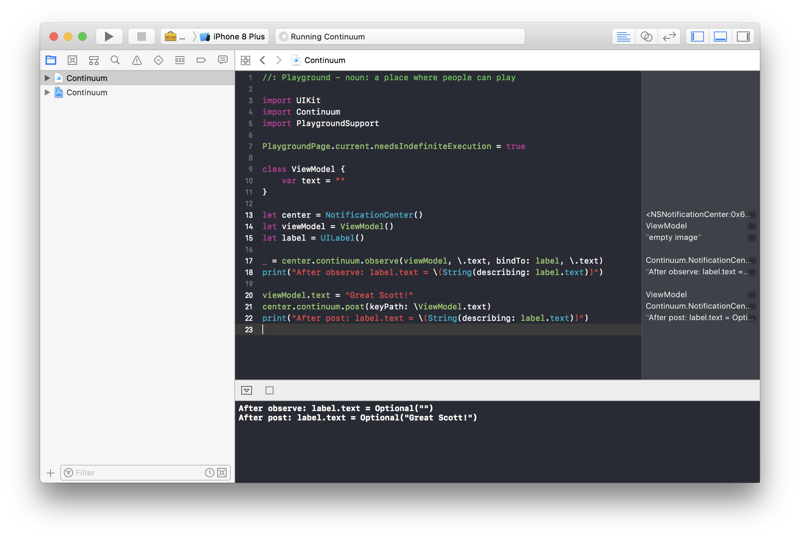
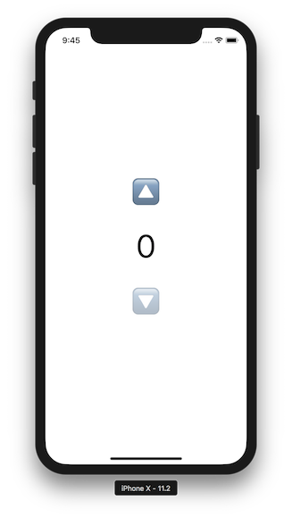

# Continuum

[](https://travis-ci.org/marty-suzuki/Continuum)
[](http://cocoapods.org/pods/Continuum)
[](https://github.com/Carthage/Carthage)
[](http://cocoapods.org/pods/Continuum)
[](http://cocoapods.org/pods/Continuum)

NotificationCenter based Lightweight UI / AnyObject binder.

```swift
final class ViewController: UIViewController {

    @IBOutlet weak var label: UILabel!

    private lazy var viewModel: ViewModel = ViewModel(center: self.center)
    private let center = NotificationCenter()
    private let bag = ContinuumBag()

    override func viewDidLoad() {
        super.viewDidLoad()

        center.continuum
            .observe(viewModel, \.text, on: .main, bindTo: label, \.text)
            .disposed(by: bag)

        viewModel.text = "Binding this text to label.text!"
    }
}

final class ViewModel {
    private(set) var text = "" {
        didSet { center.continuum.post(keyPath: \ViewModel.text) }
    }

    private let center: NotificationCenter

    init(center: NotificationCenter) {
        self.center = center
    }
}
```

## Usage

### Observe object KeyPath and bind it to target KeyPath

NotificationCenter's instance has `continuum` property. You can access Continuum functions from it.

```swift
let center = NotificationCenter()
let observer = center.continuum.observe(viewModel, \.text, on: .main, bindTo: label, \.text)
```

Above source code means `observe viewModel's text propety and bind that value to label's text property on main thread`.
If property is observed, current value comes immediately.

### Notify changes with `func post(keyPath:)`

If value changed, notify changes like this.

```swift
viewModel.text = "Changed"
center.continuum.post(keyPath: \ViewModel.text)
```

### Lifecycle of ContinuumObserver

`func observe(_:,_:,on:,bindTo:,_:)` returns `ContinuumObserver`.
If `func cancel()` of `ContinuumObserver` called, observation is cancelled.

```swift
let observer = center.continuum.observe(viewModel, \.text, on: .main, bindTo: label, \.text)
observer.cancel()
```

If adding observer to `ContinumeBag`, observation is cancelled by lifecycle of `ContinumeBag`.

```swift
var bag = ContinumeBag()
center.continuum
    .observe(viewModel, \.text, on: .main, bindTo: label, \.text)
    .disposed(by: bag)

bag = ContinumeBag() // previous instance of ContinumeBag is released and observation is cancelled.
```

## Example

### Playground

You can try **Continuum** with Playground.
Open Continuum.xcworkspace and run build.
You can try like this.



### Example Project

To run the example project, clone the repo, and run `pod install` from the Example directory first.
Open ContinuumSample.xcworkspace and run build.
You can try a simple counter app like this.



## Requirements

- Xcode 9.2 or later
- Swift 4.0.3 or later
- iOS 10.0 or later

## Installation

### CocoaPods

Continuum is available through [CocoaPods](http://cocoapods.org). To install
it, simply add the following line to your Podfile:

```ruby
pod 'Continuum'
```

### Carthage

If you’re using [Carthage](https://github.com/Carthage/Carthage), simply add Continuum to your `Cartfile`:

```ruby
github "marty-suzuki/Continuum"
```

## Author

marty-suzuki, s1180183@gmail.com

## License

Continuum is available under the MIT license. See the LICENSE file for more info.
